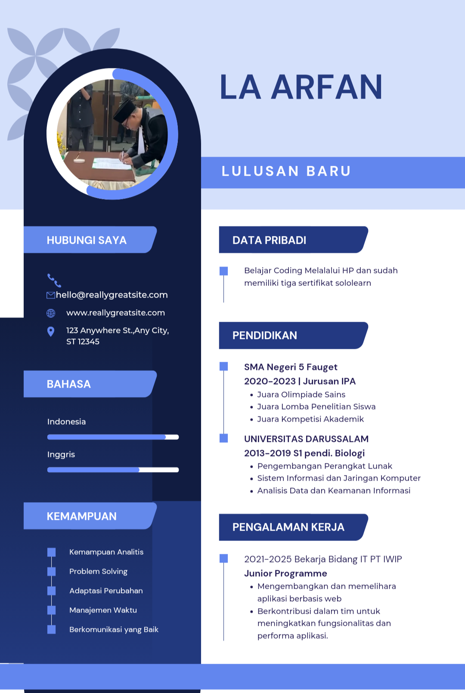

# belajar-coding-website-hp

<!DOCTYPE html>
<html>
<head>
  <title>Website Kedua Arfan</title>
  
</head>
<body>
  <h1>Halo, Ini Website Baru Saya</h1>
  
maaf jika kelihatan masih berantakan

  <!-- Gambar -->
  

</body>
</html>

</body>
</html>

<button>Klik Saya</button>

<a href="https://youtube.com/@toliambarecordwakatobi7189" target="_blank">Kunjungi YouTube</a>

<h1 style="color: blue;">Belajar Coding Melalui Hp</h1>

Saya sedang belajar coding melalui HP. Walau hanya dengan perangkat sederhana, saya tetap semangat mengasah skill setiap hari!

Belajar coding tidak harus mahal. Dengan HP di tangan, saya terus melangkah maju, menulis baris demi baris kode, mengejar mimpi jadi programmer hebat.
<h2>Tentang Saya</h2>

Nama saya Arfan. Saya belajar coding secara otodidak hanya menggunakan HP. Dengan semangat dan konsistensi, saya percaya masa depan saya bisa lebih baik melalui dunia teknologi.

<table border="1">
  <tr>
    <th>Nama</th>
    <th>Umur</th>
  </tr>
  <tr>
    <td>Arfan</td>
    <td>25</td>
  </tr>
</table>

<button onclick="alert('Halo Arfan!')">Klik Aku</button>

<!DOCTYPE html>
<html>
<head>
  <title>Belajar Coding di HP</title>
  
</head>
<body>

  <h1>Belajar Coding di HP</h1>

  

    
    
Saya belajar coding HTML dan CSS langsung dari HP dengan aplikasi Acode. Semangat terus!

    <a href="https://arfan-code123.github.io/belajar-coding-website-hp/" class="btn" target="_blank">Lihat GitHub Saya</a>
  

</body>
</html>

<button onclick="tampilkanPesan()">Klik Saya</button>

Halo, ini teks awal.

<button onclick="ubahTeks()">Ubah Teks</button>

Kamu sudah klik: 0 kali

<button onclick="tambahKlik()">Klik Lagi</button>

<!DOCTYPE html>
<html>
<head>
  <title>Belajar Coding di HP</title>
  
</head>
<body>

  <h1>Belajar Coding di HP</h1>

  

    
    
Saya belajar coding HTML dan CSS langsung dari HP dengan aplikasi Acode. Semangat terus!

    <a href="https://arfan-code123.github.io/belajar-coding-website-hp/" class="btn" target="_blank">Lihat GitHub Saya</a>
  

</body>
</html>

<button onclick="tampilkanPesan()">Klik Saya</button>

Halo, ini teks awal.

<button onclick="ubahTeks()">Ubah Teks</button>

Kamu sudah klik: 0 kali

<button onclick="tambahKlik()">Klik Lagi</button>

